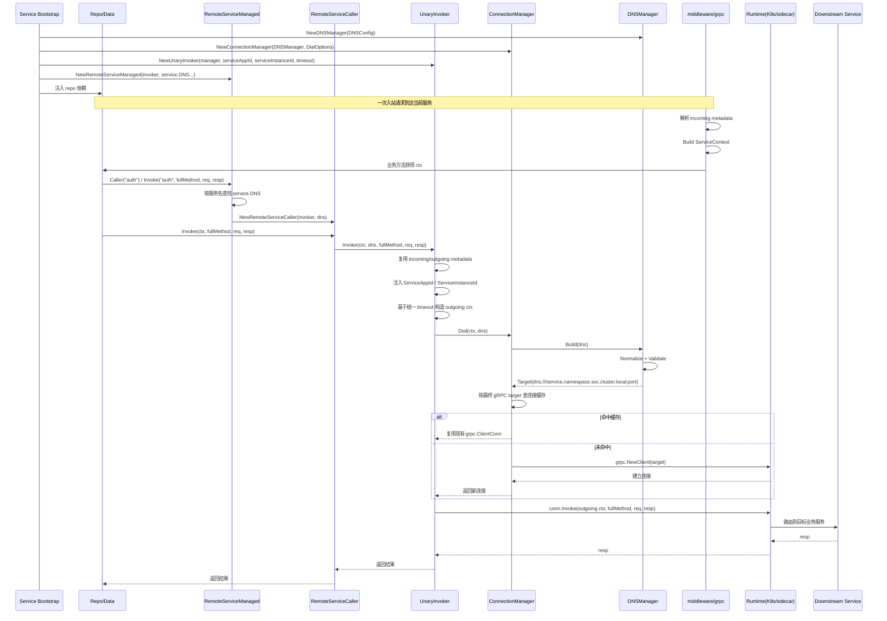

# Invocation

`invocation` 包定义 Firefly 当前唯一推荐的服务调用模型。

它只解决四件事：

- 业务侧如何使用 `service.DNS` 声明一个远程业务服务的标准 DNS
- 如何把 DNS 组装成稳定的 gRPC target
- 如何复用 `grpc.ClientConn`
- 如何统一传递 metadata

它**不再**负责：

- 实例发现
- 节点选择
- Consul / K8s 后端适配
- endpoint 轮询

## 核心理念

业务服务之间的调用，本质上就是面向一个稳定的业务服务 DNS。

例如：

```text
auth.default.svc.cluster.local:9090
```

含义如下：

- `auth`：业务服务名
- `default`：命名空间
- `svc`：Kubernetes Service 类型片段
- `cluster.local`：Cluster Domain
- `9090`：业务服务端口

业务代码只需要表达这份 DNS 结构。

后续流量如何命中实例：

- 裸机环境交给 `sidecar-agent`
- 云原生环境交给 `K8s`

## 当前模型

### service.DNS

`service.DNS` 表示业务服务的标准 DNS 配置。

它直接描述：

- `service`
- `namespace`
- `service_type`
- `cluster_domain`
- `port`

当前推荐直接使用 `service.DNS` 字面量。

除非后续出现稳定且跨仓库复用的构造规则，否则不建议再额外包一层 `service.DNS` builder 或 option helper。

### DNSManager

`DNSManager` 只负责补齐默认值并构造最终 `Target`。

它不会做：

- endpoint 拉取
- 实例选择
- 后端适配

它会做的最小校验只有两类：

- 远程业务服务名不能为空
- 命名空间不能为空

### ConnectionManager

`ConnectionManager` 负责：

- 基于 `service.DNS` 构造 `Target`
- 按最终 gRPC target 缓存连接
- 统一挂载 gRPC client dial options

### UnaryInvoker

`UnaryInvoker` 负责：

- 取连接
- 注入调用 metadata
- 注入当前服务自身的 `ServiceAppId` / `ServiceInstanceId`
- 发起真实 gRPC unary 调用

当前代码组织上，`Dialer`、`Invoker` 与 `UnaryInvoker` 已统一收口在 `invoker.go`，避免把很薄的契约层单独拆成一个文件。

推荐优先通过 `NewUnaryInvoker(...)` 装配，显式传入当前服务自身身份。

### RemoteServiceCaller

`RemoteServiceCaller` 是在 `UnaryInvoker` 之上提供的一层薄封装。

它解决的问题不是“替代 gRPC”，而是把业务 repo 里重复出现的这组样板收口：

- 绑定一个远程业务服务的 `service.DNS`
- 复用同一个 `UnaryInvoker`
- 让 repo 方法只保留 `full method + req + resp`

它绑定的是“远程业务服务”，不是某个 proto 子服务。

当 repo 已经明确绑定某一个远程业务服务时，推荐通过 `NewRemoteServiceCaller(...)` 完成标准装配。

若服务本身依赖多个远程业务服务，则更推荐先在启动装配层创建 `RemoteServiceManaged`，
再在 `New*Repo(...)` 中通过 `services.Caller("service")` 获取对应 caller。

### RemoteServiceManaged

`RemoteServiceManaged` 提供一层轻量的多业务服务装配能力。

它只负责：

- 统一登记多组远程业务服务 `service.DNS`
- 统一复用同一个 `UnaryInvoker`
- 按业务服务名返回 `RemoteServiceCaller`
- 按业务服务名直接发起 `full method` 调用

它只描述“多业务服务注册表”这层能力，不强制要求注册表必须放在某个固定目录。

常见推荐做法是：

- 在服务启动装配层集中创建 `RemoteServiceManaged`
- 在业务 repo 初始化时按业务服务名获取 caller
- 若项目已经有统一 provider / bootstrap 层，可把多业务服务注册表放在那里
- `internal/data/rs_*.go` 更适合承载“某个 repo 绑定哪个远程业务服务 caller”

### Invoke Contract

当前调用侧不再暴露 metadata / timeout 的单次调用覆盖能力。

统一约束如下：

- `UnaryInvoker` 直接复用当前链路 metadata
- `UnaryInvoker` 会在出站前注入 `ServiceAppId` / `ServiceInstanceId`
- 远程调用 timeout 在 `NewUnaryInvoker(...)` 初始化时注入
- 未显式配置 timeout 时，默认使用 `5s`

## 当前文件结构

当前目录按职责拆分为：

- `dns.go`：`DNSConfig`、`DNSManager` 和 DNS 规范化逻辑
- `target.go`：`Target` 和最终 gRPC target 表达
- `manager.go`：`ConnectionManager` 和连接缓存/拨号逻辑
- `invoker.go`：`Dialer`、`Invoker`、`UnaryInvoker` 与出站上下文构造
- `caller.go`：`RemoteServiceCaller`
- `service.go`：`RemoteServiceManaged`
- `error.go`：统一错误定义
- `TEST_REPORT.md`：当前测试覆盖率、基准与性能对比报告

## 一个业务服务多个 proto 子服务

这是当前模型里的重要约束：

- 一个远程**业务服务**只维护一份 `service.DNS`
- 同一个业务服务下的多个 proto 子服务，共用同一份 DNS 和连接
- 具体调用哪个子服务，由 gRPC full method 决定

例如：

- 远程业务服务：`auth`
- proto 子服务：
  - `AuthAppService`
  - `AuthUserService`
  - `AuthPermissionService`

这些调用都应该共用：

```text
auth.default.svc.cluster.local:9090
```

## 推荐接入方式

业务服务应在启动期集中登记远程业务服务 `service.DNS`，并在 repo 初始化时按业务服务名绑定 caller。

推荐做法：

- 在服务启动时集中声明多组远程业务服务 `service.DNS`
- 若工程存在统一装配层，优先在那里创建 `RemoteServiceManaged`
- 统一创建一份 `ConnectionManager / UnaryInvoker / RemoteServiceManaged`
- 在 `New*Repo` 中按业务服务名获取 caller
- `internal/data/rs_*.go` 只保留 repo 级别的远程服务绑定逻辑
- 通过不同 full method 区分具体 proto 子服务

不推荐做法：

- 按每个 proto 子服务单独维护一份远程地址配置
- 在调用侧做实例发现
- 在调用侧感知 Consul / K8s 细节

## 为什么不是直接 grpc client

generated gRPC client 本身没有问题，但它更适合解决：

- 我已经拿到了 `grpc.ClientConn`
- 我已经知道要调哪个 stub client
- 我现在只需要发起 RPC

而 invocation 当前要统一的是另一层语义：

- 业务服务 DNS 如何表达
- 连接如何统一复用
- metadata 如何统一透传
- OTel 如何统一接入

如果继续让每个 repo 直接面向 generated gRPC client：

- 上下文构造容易散在不同 repo 中
- metadata 透传容易出现不一致
- 调用前的统一能力不好收口

因此当前推荐是：

- `UnaryInvoker` 作为底层统一调用器
- `RemoteServiceCaller` 作为远程业务服务级别的薄封装
- 多业务服务装配优先使用 `RemoteServiceManaged`
- generated gRPC client 不作为内部统一调用主模型

## 为什么不再提供默认上下文拼装 helper

根据最新边界约束：

- `ServiceContext` 仅供服务内读取，不反向成为出站调用参数来源
- `IncomingContext` / `OutgoingContext` 只是 transport metadata 语义，不在 `invocation` 中额外落成公共上下文对象
- 服务调用时若需要沿链路透传上下文，本质上应直接复用 metadata，而不是从服务内上下文对象反向拼装

## 服务端边界

`invocation` 只负责出站调用语义。

服务端入站 metadata 解析与主上下文注入由 `middleware/grpc` 负责，服务内读取入口由 `service` 包负责：

- `gm.NewServiceContextUnaryInterceptor(...)`
- `service.FromContext(...)`

## 启动到调用时序

下面这张图描述当前推荐主线下，从服务启动装配 `invocation`，到一次下游调用真正发出的完整时序：



## 示例

```go
package example

import (
	"context"
	"time"

	"github.com/fireflycore/go-micro/invocation"
	"github.com/fireflycore/go-micro/service"
)

func Example() error {
	dnsManager := invocation.NewDNSManager(&invocation.DNSConfig{
		DefaultNamespace: "default",
		DefaultPort:      9090,
	})

	manager, err := invocation.NewConnectionManager(invocation.ConnectionManagerOptions{
		DNSManager: dnsManager,
	})
	if err != nil {
		return err
	}
	defer func() { _ = manager.Close() }()

	services := invocation.NewRemoteServiceManaged(
		invocation.NewUnaryInvoker(manager, "config", "config-1", 3*time.Second),
		service.DNS{
			Service: "auth",
		},
	)

	caller, err := services.Caller("auth")
	if err != nil {
		return err
	}

	return caller.Invoke(
		context.Background(),
		"/acme.auth.app.v1.AuthAppService/GetAppSecret",
		&struct{}{},
		&struct{}{},
	)
}
```

如果 repo 层已经明确绑定某个远程业务服务，也可以直接构造单服务 caller：

```go
package example

import (
	"context"
	"time"

	"github.com/fireflycore/go-micro/invocation"
	"github.com/fireflycore/go-micro/service"
)

func ExampleSingleCaller() error {
	dnsManager := invocation.NewDNSManager(&invocation.DNSConfig{
		DefaultNamespace: "default",
		DefaultPort:      9090,
	})

	manager, err := invocation.NewConnectionManager(invocation.ConnectionManagerOptions{
		DNSManager: dnsManager,
	})
	if err != nil {
		return err
	}
	defer func() { _ = manager.Close() }()

	caller := invocation.NewRemoteServiceCaller(
		invocation.NewUnaryInvoker(manager, "config", "config-1", 3*time.Second),
		&service.DNS{
			Service: "auth",
		},
	)
	return caller.Invoke(
		context.Background(),
		"/acme.auth.app.v1.AuthAppService/GetAppSecret",
		&struct{}{},
		&struct{}{},
	)
}
```

## 观测约定

`invocation` 默认和 `go-micro` 的 OTel 链路保持一致：

- gRPC client 默认挂 `otelgrpc`
- 出站 metadata 由 `UnaryInvoker` 基于当前链路 metadata 与服务自身身份统一构造

## 设计约束

- 业务侧只表达业务服务 DNS，不表达实例选择逻辑
- `invocation` 只保留通用调用语义，不承载后端专属实现
- `RemoteServiceCaller` 只做样板代码收口，不替代 `UnaryInvoker`
- `go-consul/invocation`、`go-k8s/invocation` 不再作为主路径保留
