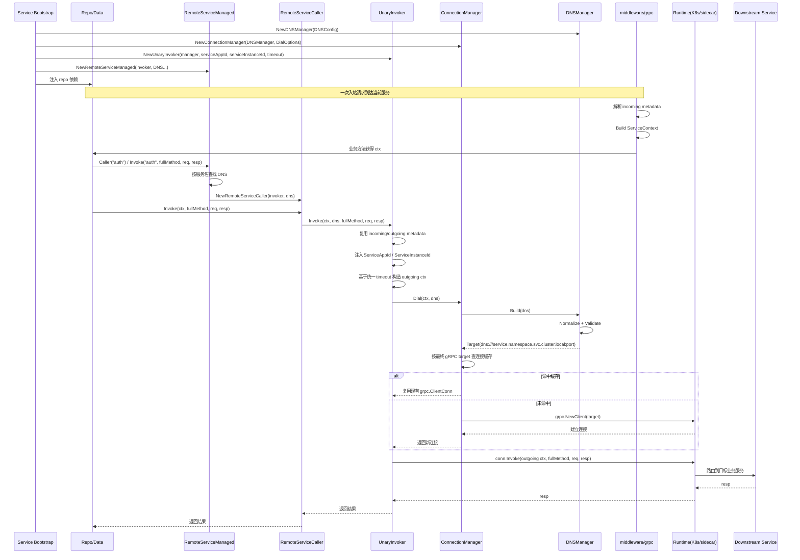

# Invocation Architecture

`invocation` 是 Firefly 当前唯一推荐的出站服务调用基础层。

它只负责四类通用能力：

- 用 `DNS` 表达远程业务服务
- 把 DNS 转成稳定的 gRPC target
- 复用 `grpc.ClientConn`
- 统一构造出站 metadata 与 timeout

它不负责运行时治理能力：

- 实例发现
- 节点选择
- Consul / K8s 后端适配
- endpoint 轮询

## 组件职责

### `DNS`

远程业务服务的标准 DNS 描述，只表达目标服务本身：

- `service`
- `namespace`
- `service_type`
- `cluster_domain`
- `port`

当前推荐直接使用 `DNS` 字面量，不再额外包一层 builder 或 option helper。

### `DNSManager`

负责把结构化 `DNS` 规范化成最终 `Target`。

它只做：

- 默认值补齐
- 最小字段校验
- 构造最终 target

它不会做：

- endpoint 拉取
- 实例选择
- 后端适配

### `ConnectionManager`

负责连接生命周期与缓存：

- 基于 `DNS` 构造 `Target`
- 按最终 gRPC target 缓存连接
- 统一挂载 gRPC client dial options

### `UnaryInvoker`

底层统一调用器，负责：

- 获取连接
- 复用当前链路 metadata
- 注入当前服务自身的 `ServiceAppId` / `ServiceInstanceId`
- 使用初始化时注入的统一 timeout
- 发起真实 gRPC unary 调用

`UnaryInvoker` 是调用主线的底座，但不再作为 repo 的首选装配入口。

### `RemoteServiceCaller`

面向单个远程业务服务的薄封装，解决 repo 层重复样板代码：

- 绑定一个远程业务服务的 `DNS`
- 复用同一个 `UnaryInvoker`
- 让 repo 方法只保留 `full method + req + resp`

它绑定的是“远程业务服务”，不是某个 proto 子服务。

### `RemoteServiceManaged`

多业务服务注册表，负责：

- 统一登记多组远程业务服务 `DNS`
- 统一复用同一个 `UnaryInvoker`
- 按业务服务名返回 `RemoteServiceCaller`
- 按业务服务名直接发起 `full method` 调用

这层只描述“多业务服务注册表”能力，不强制固定目录位置。

## 统一调用主线

当前推荐主线：

1. 启动装配层创建 `DNSManager`
2. 启动装配层创建 `ConnectionManager`
3. 启动装配层创建 `UnaryInvoker`
4. 启动装配层创建 `RemoteServiceManaged`
5. repo 在 `New*Repo(...)` 中通过 `services.Caller("service")` 绑定 `RemoteServiceCaller`
6. repo 方法调用时只传 `full method + req + resp`

如果 repo 只依赖一个远程业务服务，也可以直接装配 `RemoteServiceCaller`。

## 一个业务服务与多个 proto 子服务

当前模型的聚合单位是“远程业务服务”：

- 一个远程业务服务只维护一份 `DNS`
- 同一业务服务下多个 proto 子服务共用同一份 DNS 和连接
- 具体 RPC 由 gRPC `full method` 决定

例如：

```text
auth.default.svc.cluster.local:9090
```

这份 DNS 可以同时服务于：

- `AuthAppService`
- `AuthUserService`
- `AuthPermissionService`

## 出站规则

当前调用侧统一约束如下：

- `UnaryInvoker` 直接复用当前链路 metadata
- `UnaryInvoker` 在出站前注入 `ServiceAppId` / `ServiceInstanceId`
- timeout 在 `NewUnaryInvoker(...)` 初始化时注入
- 未显式配置 timeout 时，默认使用 `5s`
- 不再暴露 metadata / timeout 的单次调用覆盖能力

## 与服务端的边界

`invocation` 只负责出站调用语义。

服务端入站 metadata 解析与服务内主上下文注入由其他层负责：

- `gm.NewServiceContextUnaryInterceptor(...)`
- `service.FromContext(...)`

`invocation` 不再承担：

- 服务端入站 metadata 解析
- 服务内上下文缓存
- 用户上下文派生模型
- trace 快照字段模型

## 调用时序

下面这张图描述当前推荐主线下，从服务启动装配 `invocation`，到一次下游调用真正发出的完整时序：



## 为什么不是直接 generated gRPC client

generated gRPC client 更适合解决“已经拿到 `grpc.ClientConn` 之后如何调某个 stub”的问题。

`invocation` 当前要统一的是另一层语义：

- 业务服务 DNS 如何表达
- 连接如何统一复用
- metadata 如何统一透传
- OTel 如何统一接入

因此当前推荐是：

- `UnaryInvoker` 作为底层统一调用器
- `RemoteServiceCaller` 作为远程业务服务级别的薄封装
- 多业务服务装配优先使用 `RemoteServiceManaged`
- generated gRPC client 不作为内部统一调用主模型
